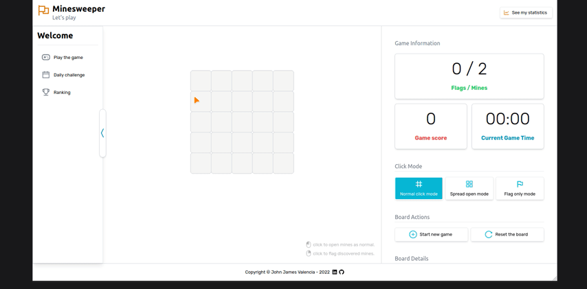
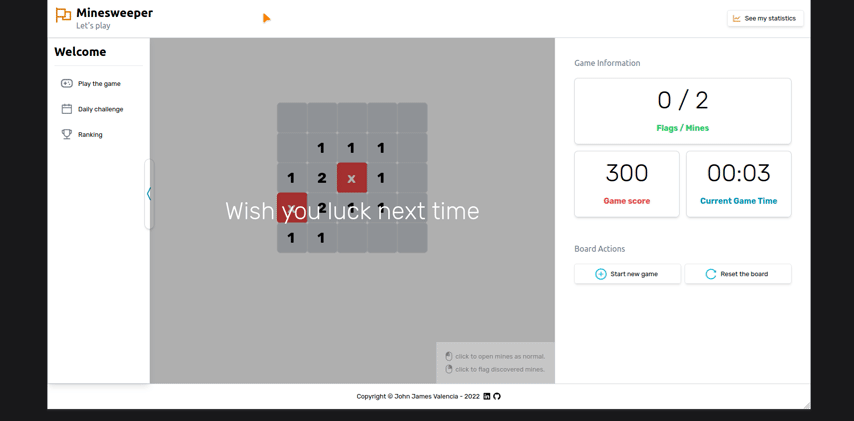

# Together Minesweeper

Little project made in react.

Is a little minesweeper game made for fun, to test react new technologies and capabilities.

## Preview

### Functional gameplay

### Focus on little details

## Tech Stack

- React JS
- Typescript
- Vite
- Tailwindcss

## Concepts used

- Reducers
- Contexts
- States
- Native rendering

## Milestones
- [x] React client
- [ ] Elixir backend
- [ ] MongoDB database
- [ ] Working ranking and daily challenge
- [ ] Docker images
